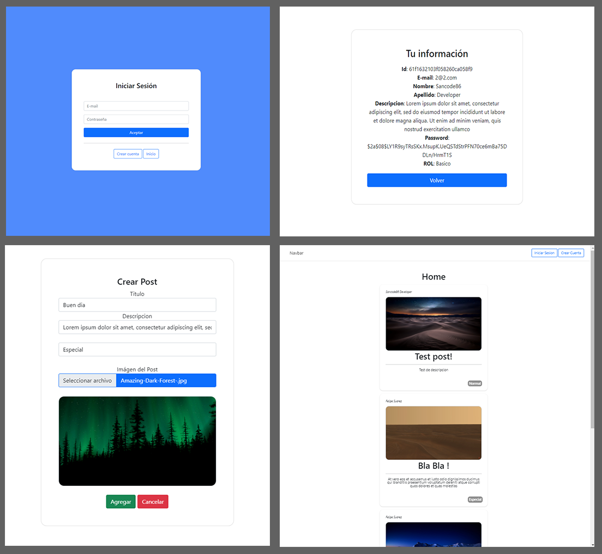

# Simple Social Media Template | Nodejs - Express- MongoDb

Using EJS for templating
## Features


- Login & Signup using passport authentication.
- View post from all users in Home page.
- Create post with basic info and upload an image.
- Basic profile view.
- Send mails to users with NodeMailer
Customize email data from:
```
    contentHTML = `
        <h1>Mensaje desde formulario WEB</h1>
        <p>Nombre: ${name}</p></br>
        <p>E-Mail: ${email}</p></br>
        <p>Teléfono: ${telefono}</p></br>
        <p>Mensaje: ${mensaje}</p>
        `;   
```
Add you email credentials in:
```
    const transporter = nodemailer.createTransport({
      service: "gmail",
      secure: false,
      auth: {
        user: "123@gmail.com",
        pass: "",
      },
    });
```
- Manage your posts, edit or delete them from general view or use the detailed table.


 - Manage users from admin panel.


You coud easily implement a comment sistem by adding corresponding field to the post model;
for example, an array that stores the user and the comment made for each post.