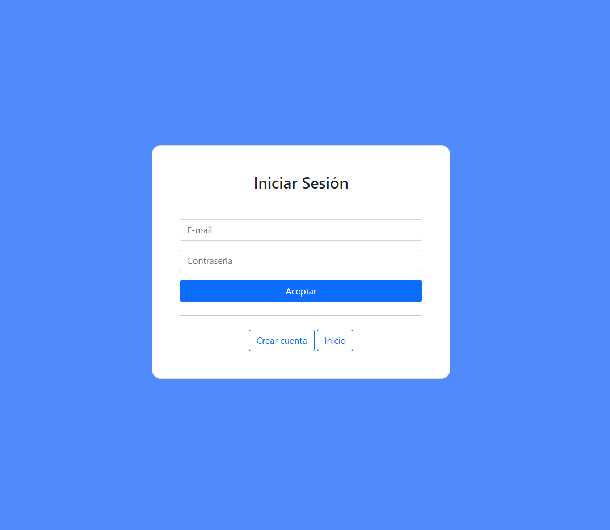
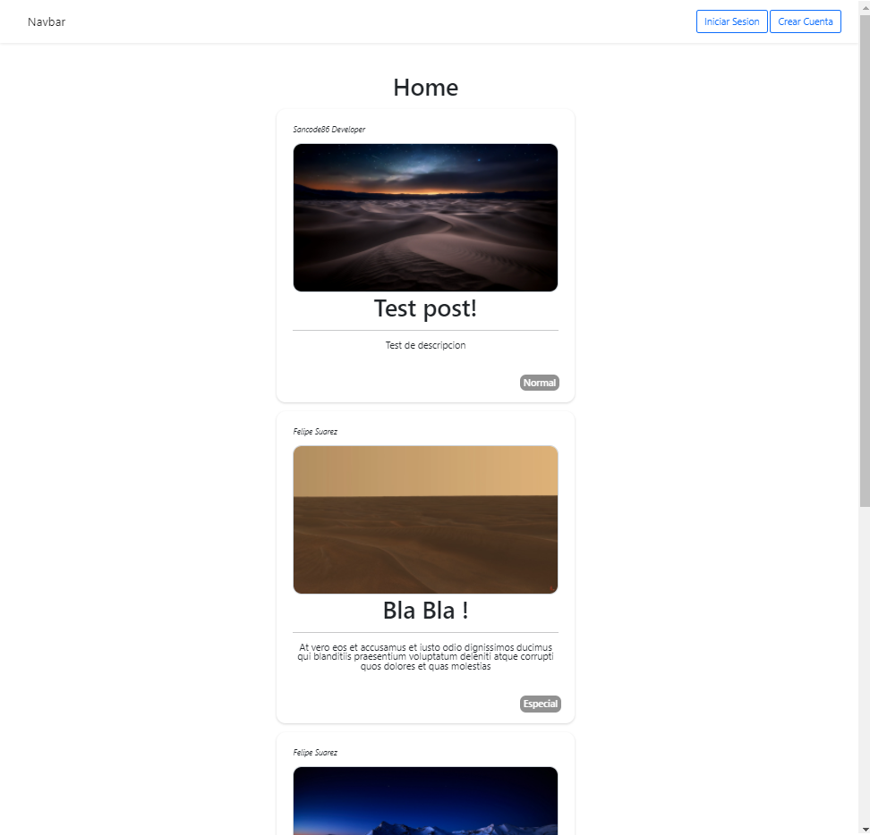
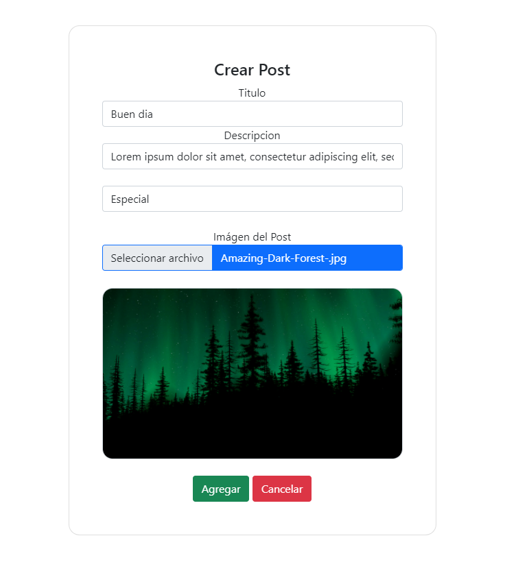
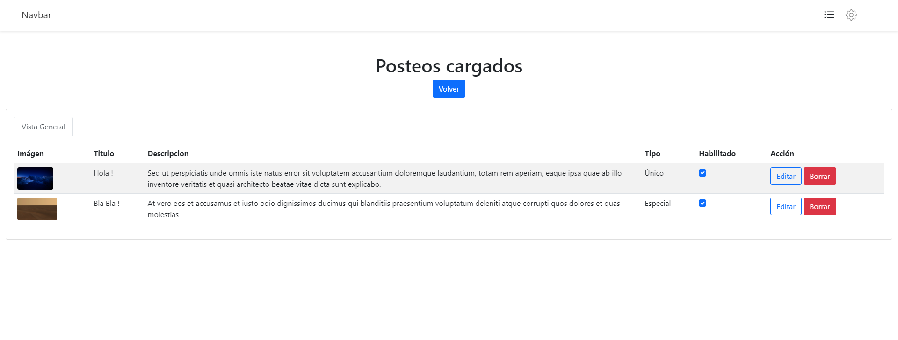
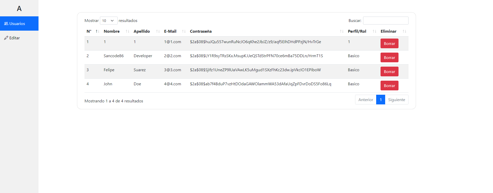

# Simple Social Media | Nodejs - MongoDb  👌

Using EJS for templating
## Features

- Login & Signup with passport authentication

- View post from all users in home page

- Create post with basic info and upload image

- Basic profile view

- Manage your posts, edit or delete them from general view or detailled 

 - Manage users from admin panel

